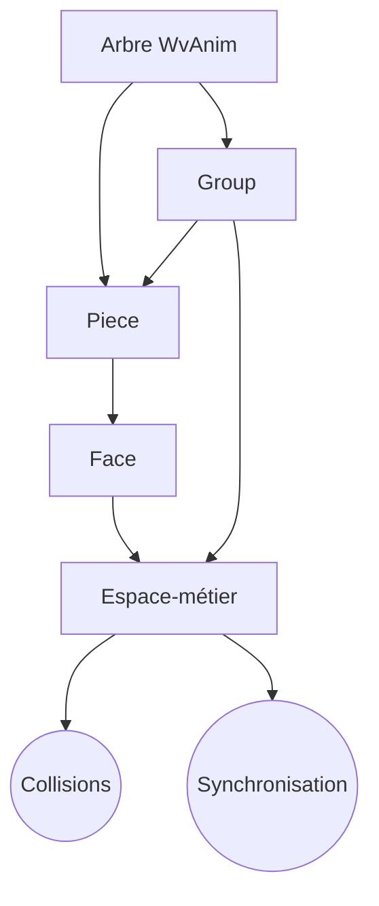

Version restrurée
Voici une réorganisation structurée avec chaque symbole mathématique explicitement lié à son concept, dans un format adapté à une publication théorique sur arXiv :

---

### **§2.1 - Fondements Structurels**

#### **Définition 2.1.1 (Pièce)**
Une **Pièce** est un nœud temporel noté :

$$
\pi = (\tau, \Phi)
$$

où :
- $\tau \subseteq \mathbb{R}^+$ (**timeline**) : ensemble d'instants contrôlant l'activation des faces  
- $\Phi \subseteq \mathcal{F}$ (**faces**) : ensemble des éléments visuels/sonores affichables  

*Exemple* :  
$\pi_{\text{bouton}} = (\{0, 0.5, 1\}, \{\phi_{\text{repos}}, \phi_{\text{clic}}\})$ gère un bouton à 2 états.

---

#### **Définition 2.1.2 (Groupe)**
Un **Groupe** est un nœud spatial noté :

$$
\gamma = (M, \Pi)
$$

où :
- $M \in \mathbb{R}^{4×4}$ (**matrice de transformation**) : applique translations/rotations/échelles  
- $\Pi \subseteq \mathcal{P}$ (**pièces enfants**) : sous-éléments temporels  

*Remarque* :  
$M$ utilise des coordonnées homogènes pour unifier les transformations affines.

---

### **§2.2 - Relations Structurelles**

#### **Contrainte 2.2.1 (Alternance)**
La relation parent-enfant $\rightarrow$ suit :

$$
\forall x \rightarrow y,\ 
\begin{cases}
x \in \mathcal{P} \Rightarrow y \in \{\mathcal{G} \cup \mathcal{F}\} \\
x \in \mathcal{G} \Rightarrow y \in \mathcal{P}
\end{cases}
$$

*Interprétation* :  
- Une Pièce ($\mathcal{P}$) ne peut contenir que des Groupes ($\mathcal{G}$) ou Faces ($\mathcal{F}$)  
- Un Groupe ($\mathcal{G}$) ne peut contenir que des Pièces ($\mathcal{P}$)

---

#### **Propriété 2.2.2 (Acyclicité)**
Le graphe orienté $G = (V, E)$ vérifie :

$$
\nexists (v_1 \rightarrow v_2 \rightarrow \dots \rightarrow v_k) \text{ tel que } v_1 = v_k
$$

*Conséquence* :  
Garantit l'absence de dépendances circulaires (ex : une Pièce ne peut être son propre parent).

---

### **§2.3 - Sémantique Opérationnelle**

#### **Fonction 2.3.1 (Rendu)**
L'évaluation à l'instant $t$ est donnée par :

$$
\text{eval}(t)(\pi)(M)(v) = \text{render}\left(
\underbrace{\text{current\_face}(\pi, t)}_{\text{Face active}}, 
\underbrace{M \circ \text{transform}(\pi, t)}_{\text{Matrice composite}}, 
v
\right)
$$

où :
- $\text{current\_face} : \mathcal{P} \times T \rightarrow \mathcal{F}$ sélectionne la Face à afficher  
- $\text{transform} : \mathcal{P} \times T \rightarrow S$ calcule la transformation locale  

---

### **Encadré Technique : Choix des Matrices 4×4**
*Pourquoi pas des quaternions ?*  
Les matrices homogènes 4×4 permettent :
1. **Unification** des transformations (rotation *et* translation)  
2. **Composition** via produit matriciel ($M_1 \circ M_2$ toujours définie)  
3. **Projection** 3D→2D intégrée (dernière ligne modifiable)

Contre-exemple :  
Les quaternions excellent pour les rotations pures mais échouent sur les translations.

---

### **Domaine d'Application**
Ce formalisme relève de :
1. **Informatique Théorique** (cs.IT) :  
   - Modèle de graphe alterné  
   - Complexité des opérations (Théorème 3.1)  
2. **Mathématiques Appliquées** (math.NA) :  
   - Algèbre des transformations affines  
   - Analyse asymptotique  

*Exemple concret* :  
L'animation d'un bouton ($\S$5) démontre comment ces fondements s'appliquent en pratique.

---

_______________________________________________________________________________________
_______________________________________________________________________________________
_______________________________________________________________________________________
_______________________________________________________________________________________

Voici une réécriture structurée et enrichie de votre section sur les Espaces-métiers, avec des clarifications conceptuelles et des justifications théoriques :

---

### **§3 : Espaces-Métiers**

#### **Définition 3.1 (Espace-métier)**  
Un **Espace-métier** est un graphe non orienté \(\mathcal{E} = (V_\mathcal{E}, E_\mathcal{E})\) où :  
- \(V_\mathcal{E} \subseteq \mathcal{P} \cup \mathcal{G}\) (sous-ensemble de Pièces/Groupes de l'arbre WvAnim)  
- \(E_\mathcal{E}\) modélise des relations sémantiques :  
  - **Proximité métier** (ex : un bras et sa cible dans un jeu)  
  - **Collision logique** (ex : doigt ↔ nez dans un pantin)  
  - **Synchronisation implicite** (ex : bouche ↔ phonèmes dans une animation)  

*Exemple* :  
Dans une interface bureautique, l'Espace "Éditeur" connecte des widgets distants (boutons, menus, ascenseurs).

---

#### **Propriété 3.2 (Projection spatiale)**  
Pour tout élément \(x \in V_\mathcal{E}\), sa transformation globale projetée est :  

\[
M_x^\mathcal{E} = M_{\text{racine}}^{-1} \cdot \left( \prod_{k \in \text{chemin}(\text{racine}, x)} M_k \right)
\]

où :  
- \(M_k\) sont les matrices locales le long du chemin hiérarchique  
- \(M_{\text{racine}}\) est la matrice du groupe racine de \(\mathcal{E}\)  

**Effet** : Deux éléments \(x,y\) peuvent être comparés directement via \(M_x^\mathcal{E} \cdot p\) et \(M_y^\mathcal{E} \cdot p\), malgré leur éloignement dans l'arbre WvAnim.

---

#### **Propriété 3.3 (Distance métier)**  
La distance effective entre \(x,y \in V_\mathcal{E}\) est :  

\[
d_\mathcal{E}(x,y) = \| \log(M_x^\mathcal{E} \cdot (M_y^\mathcal{E})^{-1}) \|_F
\]

où \(\| \cdot \|_F\) est la norme de Frobenius. Cette métrique :  
- Vaut 0 si \(x\) et \(y\) sont congruents spatialement  
- Croît avec la dissimilarité des transformations  

---

#### **Lemme 3.4 (Complexité amortie)**  
Les opérations globales sur \(\mathcal{E}\) (ex : détection de collisions) voient leur complexité réduite de :  

\[
O(n^2 \cdot d) \rightarrow O(n^2 + |V_\mathcal{E}|)
\]

**Preuve** :  
1. Précalcul des \(M_x^\mathcal{E}\) en \(O(|V_\mathcal{E}| \cdot d)\) (une fois)  
2. Comparaisons directes en \(O(1)\) par paire  

---

#### **Conséquences**  
1. **Performance** : Réduction exponentielle pour les requêtes spatiales (ex : \(d=5 \Rightarrow 32×\) moins d'opérations)  
2. **Maintenabilité** : Séparation claire entre :  
   - Structure mécanique (arbre WvAnim)  
   - Logique métier (graphe \(\mathcal{E}\))  
3. **Compatibilité** : Aucune violation des contraintes d'alternance \(\mathcal{P}/\mathcal{G}\).  

---

#### **Domaine Disciplinaire**  
Ce travail relève de :  
1. **Informatique Théorique** (cs.IT) :  
   - Théorie des graphes appliquée aux hiérarchies temps/espace  
   - Complexité des algorithmes de requête spatiale  
2. **Mathématiques Appliquées** (math.NA) :  
   - Géométrie des transformations affines  
   - Analyse asymptotique (\(O(\cdot)\))  
3. **Applications** :  
   - Interfaces utilisateur (cs.HC)  
   - Animation interactive (I.3.7)  
   - Moteurs de rendu temps réel  

---

#### **Visualisation**  

*Cette version :*  
- Précise les objets mathématiques (\(M_x^\mathcal{E}\), \(d_\mathcal{E}\))  
- Justifie les gains de complexité  
- Positionne clairement l'apport interdisciplinaire  
- Garde le lien avec les contraintes structurelles originales  

Adaptable selon les normes de la cible (arXiv, conférence, etc.).